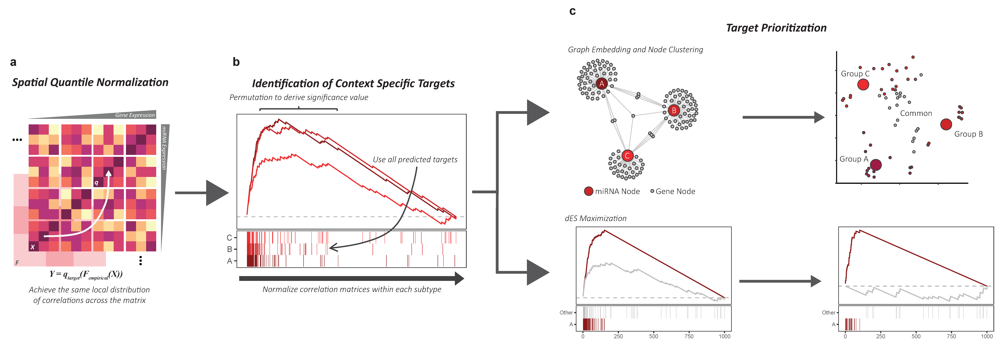

# DReAmiR
**D**ifferential **Re**gulation **A**nalysis for **miR**NAs
<!-- badges: start -->
[](https://github.com/ningb/DReAmiR/actions)
<!-- badges: end -->

## Introduction
Rewiring of transcriptional regulatory networks has been implicated in many biological and pathological processes. However, most current methods for detecting rewiring events (differential network connectivity) are not optimized for miRNA-mediated gene regulation and fail to systematically examine predicted target genes in study designs with multiple groups. We developed a novel method to address the current challenges. The `DReAmiR` method first estimates miRNA-gene expression correlations with Spatial Quantile Normalization to remove the mean-correlation relationship. Then, for each miRNA, genes are ranked by their correlation strength per group. Enrichment patterns of predicted target genes are compared using the Anderson-Darling test and significance levels are estimated via permutation. Finally, graph embedding or difference in enrichment score maximization is performed to prioritize group-specific target genes. 



## Requirements
R (>= 4.0.0) is recommended.

## Installation

`DReAmiR` is still under active development.

``` r
library(devtools)
install_github("https://github.com/ningb/DReAmiR")
```

## Usage
Here is the basic workflow for `DReAmiR`. 
### Load package and read in toy data:
``` r
library(DReAmiR)

# Read-in simulated data
target.mat <- sim.data[[1]]
group.label <- sim.data[[2]]
mrna.mat <- sim.data[[3]]
mirna.mat <- sim.data[[4]]
```
### Build correlation matrices by subtype and extract target matrix
```r
cor.list <- BuildCorList(
	mrna.mat    = mrna.mat,
	mirna.mat   = mirna.mat,
	group.label = group.label
	)
# > lapply(cor.list, dim)
# $A
# [1] 1000   20

# $B
# [1] 1000   20

# $C
# [1] 1000   20

# Build target matrix	
target.mat <- BuildTargetMat(
	mrna.mat   = mrna.mat,
	mirna.mat  = mirna.mat,
	DB         = c("targetcsan", "mirdb", "starbase"),
	org        = "hsa",
	gene.name  = "target_symbol"
	min.cutoff = 1
	)
```
### Optional: run spatial quantile normalization on the correlation matrices [[1]](#1).
*Note: this is not going to work in this toy dat since it is too small*
```r
cor.list <- RunGroupSpQN(
	mrna.mat    = mrna.mat,
	mirna.mat   = mirna.mat,
	group.label = group.label,
	cor.list    = cor.list
	)
```
### Run the main function for edifferential regulation
```r
results <- Run_diffreg(
	cor.list          = cor.list,
	target.mat        = target.mat,
	min.target.number = 5,
	direction         = "Negative"
	)
# > head(results)
#           ADval       Pval   A_Score   B_Score   C_Score
# miR_1   3.63230 8.1650e-03 0.7370506 0.6812772 0.4733412
# miR_2  10.92700 1.3873e-06 0.6731506 0.6729634 0.3102756
# miR_3  10.68900 1.9488e-06 0.6142691 0.6680506 0.2988116
# miR_4   8.22520 5.0877e-05 0.7027055 0.6946374 0.3628987
# miR_5   5.89900 6.9189e-04 0.6278100 0.7477924 0.4162563

# Optional: A permutation test can be performed to better estimate significance value
permutation.result <- Run_permutation(
	diffreg.res = results,
	mrna.mat    = mrna.mat,
	mirna.mat   = mirna.mat,
	target.mat  = target.mat,
	group.label = group.label,
	)
```
### Plot an enrichment plot for an significant miRNA
```r
Plot_enrichment(
	cor.list   = cor.list,
	miR        = "miR_1",
	target.mat = target.mat
	)
```


###	Extract leading-edge gene and prioritize targets using either <u>Graph Representation Learning [[2]](#2)</u> or <u>dES maximization</u>.
```r
# Get the leading-edge genes
le.gene <- GetLE(
	cor.list   = cor.list,
	target.mat = target.mat,
	miR        = "miR_1",
	direction  = "Negative"
	)

# Run Graph Embedding
embedded.features <- Run_LINE(
	le.gene   = le.gene,
	dim       = 5,
	edge.sign = "Negative"
	)

selectK(embedded.features, k.range=2:10)

cluster.result <- AssignTargetCluster(
	normalize_matrix = embedded.features,
	select.k         = 7,
	group.label      = group.label
	)

# Run dES Maximization for group A relative to B
max.dES.result <- Find_Target_Max_dES(
	gs        = le.gene[["A"]],
	cor.list  = cor.list,
	main      = "A",
	ref       = "B",
	miR       = "miR_1", 
	direction = "Negative"
	)
```
## References
<a id="1">[1]</a> :
Wang, Yi, Stephanie C Hicks, and Kasper D Hansen. 2020. “Co-Expression Analysis Is Biased by a Mean-Correlation Relationship.” bioRxiv, 2020.02.13.944777. https://doi.org/10.1101/2020.02.13.944777.

<a id="2">[2]</a> :
https://github.com/YosefLab/Rline
